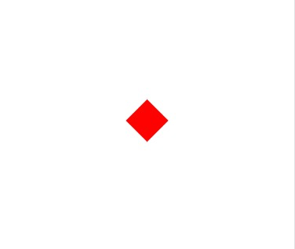

# 一只Bird

引入概念：`显示对象`

显示对象是游戏客户端渲染的基本对象，可理解为div

在body中插入一个div
```html
<div id="bird"></div>
```

把div放在你喜欢的位置，加上你喜欢的颜色
```css
#bird {
    /* 大小 */
    width: 100px;
    height: 100px;

    /* 颜色 */
    background-color: #f00;

    /* 位置 */
    position: absolute;
    top: 50%;
    left: 50%;

    /* 旋转、缩放等属性 */
    transform: scale(1, 1) rotate(45deg);

    /* 锚点 */
    transform-origin: center;
}
```

经过一顿操作，我们得到了自己喜欢的一只Bird，如下图

