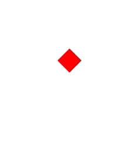

# 会飞的Bird

引入概念：使用`动画`改变显示对象属性

动画是一个游戏重要的组成部分，如果没有动画，游戏将变得枯燥无味

本小节创建一个简单keyframe动画，以此来理解游戏中的动画

在style标签中加入一段动画的代码
```css
@keyframes bird-fly {
    0% {
        top: 50%;
        transform: scale(1, 1) rotate(45deg)
    }
    50% {
        top: 30%;
        transform: scale(1, 1) rotate(45deg)
    }
    100% {
        top: 50%;
        transform: scale(1, 1) rotate(45deg)
    }
}
```

把刚刚我们写的css动画应用在我们的Bird上  
```css
#bird {
    [...]
    
    /* 动画 */
    animation: bird-fly 5s infinite;
}
```

经过一顿操作，我们得到了自己一只活生生的鸟  
但是这样的方式似乎无法自由的操作  
想想王者荣耀，你的英雄该如何送塔？
如下图:  

