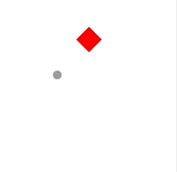
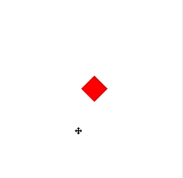

# 点哪飞哪

引入概念：`输入输出` `游戏主循环`

经过上一节的思考，我们已经得到了一只不听话的Bird和一份王者荣耀快速送塔的方案 那就是```输入输出```

本节的内容是训练Bird，让它可以点哪飞哪

## 一、输入

```javascript
// 使用mousedown监听鼠标按下，并获得鼠标点击的位置
const mouseDown = (e) => {
	// 直接改变bird的位置，没有动画
	bird.style.top = e.clientY + "px";
	bird.style.left = e.clientX + "px";
}
document.addEventListener('mousedown', mouseDown);
```

再次运行案例，点击屏幕  
我们的Bird不仅听话，还学会了闪现，还没有冷却。  
开挂了，一顿操作，被举报封号，这怎么行，开挂也要演一演   


## 二、主循环

`主循环`是游戏的基本要素之一  
如果不能很好的理解主循环，将无法真正的理解游戏  
如果你是个小白，某老师直接就教你一款游戏引擎的API，那么你可以直接拍屁股走人了

在循环中，主要做两件事:

- 1.数据更新
- 2.渲染更新

### 1.创建循环 - (使用`setInterval`来模拟游戏循环)

隆重的介绍:`setInterval`

```js
setInterval(handler, timeout, ...arguments);
```

我们需要做以下几件事：

- 1.给鸟一个飞行速度`speed`即每次循环飞多少距离   
  用一个变量`pos`记录Bird当前的位置   
  用一个变量`clickPos`记录鸟要飞到的位置即鼠标点击的位置

```javascript
const speed = 10;   // bird的速度 每次移动多少距离
const pos = {   // bird的位置  bird当前的位置
	top: 0,
	left: 0,
}

const clickPos = { // 鼠标点击的位置 bird将要的到达的位置
	top: 0,
	left: 0,
}
```

- 2.在点击鼠标后记录需要到达的位置而不是立即改变

```javascript
// 使用mousedown监听鼠标按下，并获得鼠标点击的位置
const mouseDown = (e) => {
	// 直接改变bird的位置，没有动画
	// bird.style.top = e.clientY + "px";
	// bird.style.left = e.clientX + "px";

	// 记录bird将要到达的位置，使用动画慢慢到达
	clickPos.top = e.clientY;
	clickPos.left = e.clientX;
}
```

- 3.在循环中计算当前循环之后鸟到达的位置
- 4.更新鸟的位置

```javascript
setInterval(() => {
	/**
	 * 计算Bird的位置(数据更新)
	 */
	// 计算新的top
	if (pos.top !== clickPos.top) {
		const dis = clickPos.top - pos.top; // 计算差值
		const dir = dis > 0 ? 1 : -1;  // 计算在top上移动的方向 1 正向移动 或 -1 反向移动;

		// 如果速度过快，本次移动直接过头了(即差值<速度)，就直接移动到指定top
		if (Math.abs(dis) < speed) {
			pos.top = clickPos.top;
		} else {
			pos.top = pos.top + dir * speed;    // 计算新的top，新的位置 = 之前的位置 + 方向 * 速度
		}
	}

	// 用相同的方式计算left
	if (pos.left !== clickPos.left) {
		const dis = clickPos.left - pos.left;
		const dir = dis > 0 ? 1 : -1;

		if (Math.abs(dis) < speed) {
			pos.left = clickPos.left;
		} else {
			pos.left = pos.left + dir * speed;
		}
	}

	/**
	 * 更新显示对象位置(渲染)
	 */
	bird.style.top = pos.top + "px";
	bird.style.left = pos.left + "px";
}, 10);
```

运行案例，我们得到了演员Bird


