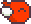

# 精灵 Sprite

引入概念：`精灵` `Sprite`

经过上一节的操作，我们已经得到了一只性能很高的Bird

如果一款游戏只有大红大绿的方块，那一定也是没人玩的

所以本节我们将要介绍游戏中的一个重要的概念`精灵`，即`Sprite`

各位可将它理解为图片即``

- 1.创建一个``模拟精灵的创建。这样将会更容易理解    
  你也可以使用一个`<div></div>`， 因为在游戏开发中，`组合`优于`继承`，组件化游戏开发多采用此方案

```html

```

- 2.给精灵一个样式

```css
#bird {
    /* 位置 */
    position: absolute;

    /* 旋转、缩放等属性 */
    transform: scale(1, 1) rotate(0deg);
    transform-origin: center; /* 锚点 */
}
```

到此结束，我们已经有了第一个有头有脸的显示对象

