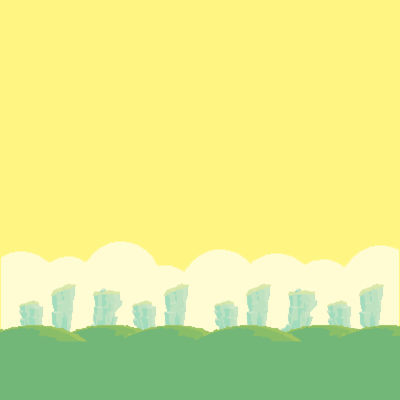

# FlppyBird - 背景循环滚动

引入概念：`无缝滚动` `组件抽象` `游戏优化-节省内存`

经过之前的内容我们已经在游戏开发中实践了面向对象

按照这样的写法，游戏开发会变得简单，代码可维护性更强，在面向对象的开发模式上，可抽象出一些通用的东西，成为组件，还可以开发可视化编辑器，提高效率

本节开始将会带大家在之前的基础上一步一步开发一款曾经举世闻名的小游戏`FlppyBird`

## 背景循环滚动

在游戏中内存是非常宝贵的，而占用内存的资源一般是图片，音频，视频，动画文件等。

FlppyBird占内存不过50MB，但是关卡背景图片却可以无限延长

> 图片占用内存的计算方式：`长 * 宽 * 每个像素的位数 / 8`

查阅图片内存计算公式，还以为百度在骗人

其实FlppyBird的背景图片只有320*640这么大，通过缩放等方式适配了你的手机，再通过两张图片循环滚动的方式达到背景图片无限长度的效果

本节将来教大家实现背景无限滚动的效果

在上一节课的基础上添加以下html代码   
注意层级，bg应该在bird的下面

## 1.准备工作

```html

<div id="bg">
    
    
</div>
```

创建一个变量，让我们可以方便的拿到屏幕宽高

```javascript
/**
 * 屏幕宽高
 * @type {{width: number, height: number}}
 */
const winSize = {
		width: document.body.clientWidth,
		height: document.body.clientHeight,
	}
```

在之前写好的GameObject类中添加一个方法，该方法用于获取这个游戏对象的宽高

```javascript
/**
 * 抽象了一个简单的GameObject
 */
class GameObject {
	/* ... */

	/**
	 * 获得宽高
	 * @returns {{width: number, height: number}}
	 */
	get size() {
		return {
			width: this.dom.clientWidth,
			height: this.dom.clientHeight,
		}
	}

	/* ... */
}
```

## 2.实现滚动

实现一个背景管理器，继承GameObject中通用的一些生命周期

```javascript
class BgMgr extends GameObject {

	speed; // 滚动速度
	bg1;    // bg1
	bg2;    // bg2

	constructor(id, bg1, bg2, speed = 5) {
		super(id);
		this.bg1 = bg1;
		this.bg2 = bg2;
		this.speed = speed;

		bg1.top = winSize.height - bg1.size.height; // 放在底部
		bg2.top = winSize.height - bg2.size.height; // 放在底部
	}

	update() {
		super.update();
		// 获取一些参数
		let bg1Left = this.bg1.left;
		const bg1Width = this.bg1.size.width;

		// 计算位置
		bg1Left -= this.speed;  // 计算位置
		this.bg1.left = bg1Left;    // 设置bg1的位置
		this.bg2.left = bg1Left + this.bg1.size.width;  // bg2跟在bg1后面

		// 如果超出屏幕则交换bg1和bg2，为了做到循环滚动
		if (bg1Left <= -bg1Width) {
			const temp = this.bg1;
			this.bg1 = this.bg2;
			this.bg2 = temp;
		}
	}
}
```

将两张背景图定位在最底下，bg1向左移动，bg2紧跟在背景1后面，如果bg1移出了屏幕，则交换变量bg1和bg2，那么bg1将跟在bg2后面移动，实现了循环滚动

将他们加入渲染和更新队列

```javascript
/**
 * 数据更新
 */
function update() {
	// bird更新
	bird.update();

	// 背景更新
	bgMgr.update();
	bg1.update();
	bg2.update();
}

/**
 * 渲染更新
 */
function render() {
	// bird渲染
	bird.render();

	// 背景渲染
	bgMgr.render();
	bg1.render();
	bg2.render();
}
```

再次运行案例，发现效果已经实现


## 3.地面滚动

在FlppyBird中还有一个地面也在滚动。  
因为我们已经实现了背景滚动，地面滚动当然和背景的逻辑一样  
但是，这就很巧了，刚才我们实现的背景滚动功能比较完善，只需要用相同的方式创建地面就可以做到地面滚动

于是乎，我们将BgMgr的名字改成ScrollMgr

```javascript
class ScrollMgr extends GameObject {
	/* ... */
}
```

并更新代码，然后创建我们的地面，同时加入渲染列表
> 为地面和背景赋予不同的滚动速度可以得到远处慢，近处快的效果

```javascript
// 创建鸟
const bird = new Bird("bird", 15);

// 创建背景
const bg1 = new GameObject("bg_1");
const bg2 = new GameObject("bg_2");
const bgMgr = new ScrollMgr("bg", bg1, bg2, 2);

// 创建地面
const land1 = new GameObject("land_1");
const land2 = new GameObject("land_2");
const landMgr = new ScrollMgr("land", land1, land2, 5);

// 将背景放在地面的上面，因为默认top是0，子节点在内部定位在底部，所以只需要把背景定位在负的land的高度就可以了
bgMgr.top = -land1.size.height;

/**
 * 数据更新
 */
function update() {
	// bird更新
	bird.update();

	// 背景更新
	bgMgr.update();
	bg1.update();
	bg2.update();

	// 地面更新
	landMgr.update();
	land1.update();
	land2.update();
}

/**
 * 渲染更新
 */
function render() {
	// bird渲染
	bird.render();

	// 背景渲染
	bgMgr.render();
	bg1.render();
	bg2.render();

	// 地面渲染
	landMgr.render();
	land1.render();
	land2.render();
}
```

运行案例，发现效果已经实现


