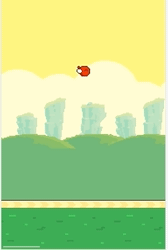
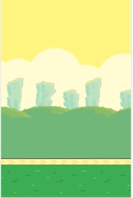

# FlppyBird - 模拟重力

引入概念：`模拟重力`

上节中我们已经完善了GameObject并且增加了一个公共变量来获取屏幕的宽高，还实现了背景的滚动和地面的滚动，并且增加了远慢近快的效果

本节将带大家来实现FlppyBird中的主角

- 简单的自由落体
- 点击屏幕飞起

## 1.改造Bird

- 1.增加`gravity`，代表重力加速度，并且把鸟的位置默认放到屏幕中间

```javascript
class Bird extends GameObject {

	speed;  // bird的速度 每次移动多少距离

	gravity;    // 重力加速度

	constructor(id, gravity = 0.2, speed = 0) {
		super(id);
		this.speed = speed; // 保存speed
		this.gravity = gravity; // 保存gravity

		// 放到屏幕中间
		const { width, height } = this.getSize();
		this.setPosition(
			(winSize.height - height) / 2,
			(winSize.width - width) / 2,
		);
	}

	/* ... */

}
```

- 2.重写Bird的生命周期`update`

> 速度公式 v = v0 + a * t² 速度 = 速度 + 加速度 * 时间²

根据速度公司，我们很容易就算出了当前帧的速度，并且算出当前的位置

```javascript
class Bird extends GameObject {

	/* ... */

	update() {
		super.update();

		let top = this.getPosition().top

		// v = v0 + a * t²
		this.speed += this.gravity; // 速度 = 速度 + 加速度 * 时间²

		top += this.speed;  // 更新位置

		this.setPosition(top);
	}
}
```

- 3.修改Bird的创建

因为指定了默认参数，所以无需再传入新的参数

```javascript
    // 创建鸟
const bird = new Bird("bird");
```

运行案例，发现Bird很快落出屏幕，一去不复返



- 3.点击屏幕飞跃

修改点击屏幕的回调函数，在点击之后修改Bird的speed属性为负就可以达到飞起的效果

```javascript
// 使用mousedown监听鼠标按下，并获得鼠标点击的位置
const mouseDown = (e) => {
	bird.speed = -8;
}
document.addEventListener('mousedown', mouseDown);
```

再次运行案例，点击屏幕发现Bird飞跃而起


