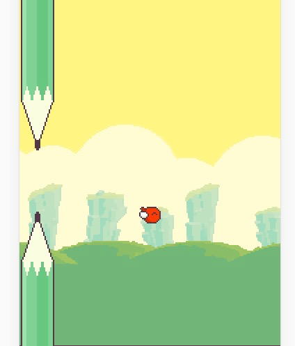
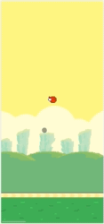

# FlppyBird - 创建障碍

引入概念：`动态生成障碍`

本节将在上节的内容上，实现动态添加障碍

## 1.实现`Pie`类

- 实现`Pie`类，继承`GameObject`
- `Pie`包含一个上的一个下的
- 上下两个均为`Sprite`，且中间距离随机

```javascript
/**
 * Pie
 */
class Pie extends GameObject {
	up;     // 钢管上部分
	down;   // 钢管下部分

	constructor() {
		super();
		this.up = this.addChild(new Sprite("../images/bird/pie_up.png"));
		this.down = this.addChild(new Sprite("../images/bird/pie_down.png"));
	}

	/**
	 * 注意此函数非真正的ready函数，在被addChild的时候都会执行一次
	 */
	ready() {
		super.ready();

		// 随机中间的距离
		const dis = Math.random() * 80 + 100;
		this.down.top = this.up.size.height + dis;
	}

	// 这里重写一下size，因为子节点使用绝对定位的不计算入包围盒内，真尴尬
	get size() {
		return {
			width: this.up.size.width,
			height: this.down.top + this.down.size.height
		}
	}
}
```

尝试在`FlppyBird`的`ready`函数中创建，得到如下效果


## 2.实现动态创建`Pie`且高度随机，从屏幕左边出现向左移动

- 创建`PieMgr`类管理`Pie`的创建和移动
- 实现创建`Pie`的方法，让`Pie`从屏幕左边出现且高度随机，并统一管理
- 创建定时器，固定事件创建`Pie`
- 在`update`函数中让所有`Pie`同时向左移动

```javascript
/**
 * PieMgr
 */
class PieMgr extends GameObject {

	pieArr = []; // 所有的Pie
	speed; // Pie移动的速度
	delay; // 添加Pie的延时

	constructor(speed, delay) {
		super();
		this.speed = speed;
		this.delay = delay;
	}

	ready() {
		super.ready();

		// 创建计时器来固定时间创建Pie
		setInterval(() => this.createPie(), this.delay);
	}

	/**
	 * 创建Pie
	 */
	createPie() {
		const pie = this.addChild(new Pie());
		this.pieArr.push(pie);  // 加入列表统一管理
		pie.top = Math.random() * -150; // 高度随机
		pie.left = winSize.width;   // 从屏幕左边出现
	}

	update() {
		super.update();

		// 所有的Pie同时向左移动
		const { speed, pieArr } = this;
		pieArr.forEach((pie) => {
			pie.left -= speed;
		});
	}
}
```

## 3.创建`PieMgr`实例并添加到节点树上

- 创建`PieMgr`实例
- 添加到节点树上，且层级在地面和背景的中间

```javascript
class FlppyBird extends GameStage {
	
	pieMgr;

	/* ... */

	async ready() {

		// 创建背景
		const bg1 = new Sprite("../images/bird/background.png");
		const bg2 = new Sprite("../images/bird/background.png");
		const bgMgr = this.bgMgr = new ScrollMgr(bg1, bg2, 2);

		// 创建地面
		const land1 = new Sprite("../images/bird/land.png");
		const land2 = new Sprite("../images/bird/land.png");
		const landMgr = this.landMgr = new ScrollMgr(land1, land2, 4);

		const pieMgr = this.pieMgr = new PieMgr(4, 1000); // 创建PieMgr

		this.addChild(bgMgr);
		this.addChild(pieMgr);  // 加在背景和地面的中间
		this.addChild(landMgr);

		/* ... */
	}

	/* ... */

}
```

运行案例发现，每秒创建一个`Pie`，且从屏幕右边出现，不断相左移动


