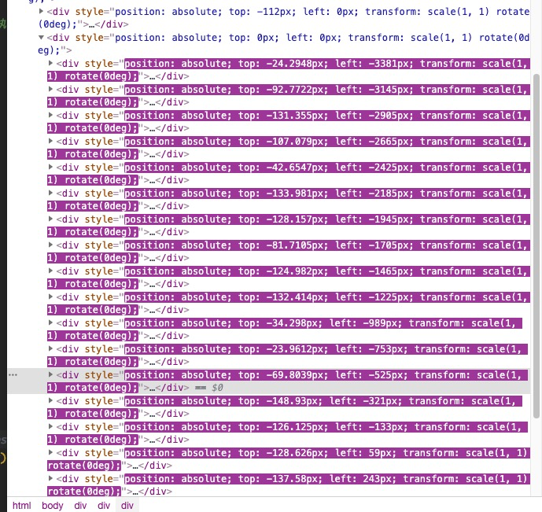

# FlppyBird - 对象池

引入概念：`对象池`

上节我们完成了障碍的动态创建

但是运行一段时间发现，dom节点树上有n个障碍，卡得一批

这些移出屏幕的障碍，不仅占了大量内存，而且他们其实完全不需要更新和渲染



## 对象池

使用对象池，回收对象，保存在池中，需要的时候不必再重新创建，只需要从池中获取就可以

对象移除显示列表的时候，放回池中就可以了

- 创建`ObjectPool`类
- 用一个静态变量来保存对象
- 实现静态方法`put`接口，传入`name`来区分保存对象的类型，这样可以保存不同的类型的对象
- 实现静态方法`get`接口，传入`name`来获取相应的类型的对象

```javascript
/**
 * 一个简单的通用对象池
 */
class ObjectPool {

	static objs = {};

	static put(name, obj) {
		const pool = ObjectPool.objs[name] || (ObjectPool.objs[name] = []);

		pool.push(obj);
	}

	static get(name) {
		const pool = ObjectPool.objs[name] || (ObjectPool.objs[name] = []);

		if (pool.length <= 0) {
			return null;
		}

		return pool.shift();
	}
}
```

## 改造`PieMgr`

- 创建`Pie`时先从对象池中获取，如果没有，则新创建
- 当`Pie`移出屏幕后，从托管列表中移除，从子节点移除，并且放回对象池

```javascript
class PieMgr extends GameObject {

	/* ... */

	/**
	 * 创建Pie
	 */
	createPie() {
		// 使用对象池 如果对象池中取不到，说明对象池空了，需要新创建
		const pie = ObjectPool.get("pie") || new Pie();
		this.addChild(pie);
		this.pieArr.push(pie);  // 加入列表统一管理
		pie.top = Math.random() * -150; // 高度随机
		pie.left = winSize.width;   // 从屏幕左边出现
	}

	update() {
		super.update();

		// 所有的Pie同时向左移动
		const { speed, pieArr } = this;
		pieArr.forEach((pie) => {
			pie.left -= speed;
			if (pie.left <= -pie.size.width) {  // 如果移出屏幕
				this.pieArr.splice(this.pieArr.indexOf(pie), 1);    // 从托管列表里移除
				this.removeChild(pie);                              // 从子节点移除
				ObjectPool.put("pie", pie);                         // 加入对象池
			}
		});
	}
}
```

运行案例，挂机10分钟，一点也不卡，显示列表最多也只有两个`Pie`同时存在

# 挂机一天也不卡，牛逼
