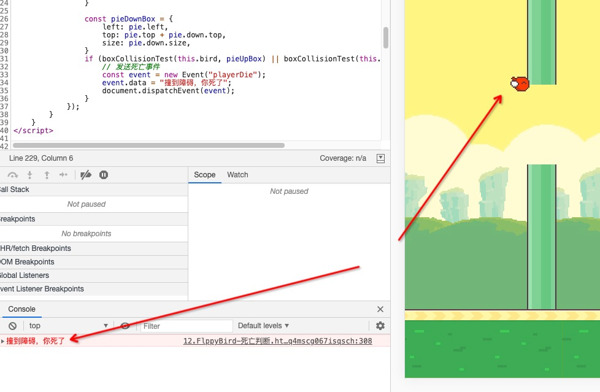

# FlppyBird - 死亡判断

引入概念：`碰撞` `盒式碰撞`

上节我们完成了障碍创建的优化，性能提升一大截

本节将完成死亡条件的判断, 本案例的碰撞检测的方式包含一些强引用，并不适用于大型项目的开发

- ### 1.落到地面死亡
- ### 2.撞到障碍死亡
- ### 3.死亡暂停游戏

## 落地死亡

首先先修改一下`Bird`类, 增加一个`dieLine`的参数，表示为死亡线，如果我们的玩家碰到这根线则判定为死亡

```javascript
class Bird extends Sprite {
	/* ... */
	dieLine; // 死亡线
	/* ... */
}
```

修改`FlppyStage`中的`ready`，在所有节点都`addChild`之后设置鸟的死亡线
> 因为dom限制，无法在节点不在渲染的时候拿到clientWidth等属性，故要在在所有节点都`addChild`之后才设置鸟的死亡线

因为地面放在`landMgr`的最底下，且`landMgr`的大小和`body`一样，故`land`和`Bird`在同一空间下

得到死亡线高度为`winSize.height - land1.size.height`

```javascript
class FlppyBird extends GameStage {

	/* ... */

	async ready() {
		/* ... */

		// 死亡线
		bird.dieLine = winSize.height - land1.size.height;

		/* ... */
	}

	/* ... */

}
```

修改`Bird`的`update`函数

- 撞到死亡线即停留在死亡线
- 打印 `坠机了，你死了`

> 因为锚点在左上角的关系，故在计算是否死亡时，应将dieLine减去自己的高度

```javascript
class Bird extends Sprite {

	/* ... */

	dieLine; // 死亡线

	/* ... */

	update() {
		super.update();

		// v = v0 + a * t²
		this.speed += this.gravity; // 速度 = 速度 + 加速度 * 时间²

		let top = this.top + this.speed;  // 更新位置

		// dieLine 因为锚点在左上角所以dieLine应该减去自己的高度
		const dieLine = this.dieLine - this.size.height;

		// 如果大于dieLine了就停在dieLine
		if (top > dieLine) {
			top = dieLine;
			console.log("坠机了，你死了");
		}

		this.top = top;

	}

}
```

运行代码发现`bird`会停在地面，并且控制台打印 `坠机了，你死了`


## 盒子碰撞

盒子碰撞是使用游戏对象的包围盒检测是否有交集来判断是否碰撞

将盒子映射到x轴和y轴，得到线段A1->A2, B1->B2, A3->A4, B3->B4

如果A1->A2和B1->B2有交集，且A3->A4和B3->B4也有交集，则可认定两个盒子相交，即两个对象碰撞

如图 无交集 判定为无碰撞


如同 只有一条轴上的映射有交集 判定为无碰撞


如图 两条轴上的映射都有交集 判定为碰撞


代码实现

```javascript
/**
 * 盒子碰撞
 * @param rect1 {top, left, size:{width, height}}
 * @param rect2 {top, left, size:{width, height}}
 * @returns {boolean}
 */
function boxCollisionTest(rect1, rect2) {
	const { top: t1, left: l1 } = rect1;
	const { width: w1, height: h1 } = rect1.size;

	const { top: t2, left: l2 } = rect2;
	const { width: w2, height: h2 } = rect2.size;

	const b1 = t1 + h1,
		b2 = t2 + h2,
		r1 = l1 + w1,
		r2 = l2 + w2;

	return ((t1 > t2 && t1 < b2) || (t2 > t1 && t2 < b1))  // 检查 t1->b1 和 t2->b2 的交集
		&& ((l1 > l2 && l1 < r2) || (l2 > l1 && l2 < r1));   // 检查 l1->r1 和 l2->r2 的交集
}
```

## 改造`PieMgr`

- 传入我们的主角`bird`
- 在移动`pie`之后检查碰撞

```javascript
/**
 * PieMgr
 */
class PieMgr extends GameObject {

	/* ... */

	bird;   // 玩家

	/* ... */

	update() {
		super.update();

		// 所有的Pie同时向左移动
		const { speed, pieArr } = this;
		pieArr.forEach((pie) => {
			// 移动
			pie.left -= speed;
			if (pie.left <= -pie.size.width) {  // 如果移出屏幕
				this.pieArr.splice(this.pieArr.indexOf(pie), 1);    // 从托管列表里移除
				this.removeChild(pie);                              // 从子节点移除
				ObjectPool.put("pie", pie);                         // 加入对象池
				return;
			}

			// 检查碰撞
			// 重构盒子，因为pie.up和pie.down的坐标是相对于pie的，所以要重构正方形的left和top
			const pieUpBox = {
				left: pie.left,
				top: pie.top + pie.up.top,
				size: pie.up.size,
			}

			const pieDownBox = {
				left: pie.left,
				top: pie.top + pie.down.top,
				size: pie.down.size,
			}
			if (boxCollisionTest(this.bird, pieUpBox) || boxCollisionTest(this.bird, pieDownBox)) {
				console.log("撞到障碍，你死了");
			}
		});
	}
}

const pieMgr = this.pieMgr = new PieMgr(4, 1000, bird);
```

运行案例得到效果


## 死亡暂停游戏

在本案例中我们可以简单的将暂停游戏简单的理解为暂停循环

- 在FlppyBird的`update`中插入控制变量`pause`
- 如果`pause`为真则不执行`super.update`

```javascript
class FlppyBird extends GameStage {

	pause = false;

	/* ... */

	update() {
		if (this.pause) return;
		super.update();
	}

}
```

使用事件通知游戏暂停

本案例不带大家实现自己的事件收发器

借用强大的`document`来实现事件收发

每一个dom节点其实都继承了一个事件收发器，所以可以直接利用dom节点做事件收发

- 在`FlppyBird`的`ready`中监听`playerDie`事件，并在`destroy`中移除
- 将之前的死亡打印，变为发送`playerDie`事件

```javascript
class FlppyBird extends GameStage {

	/* ... */

	pause = false;

	async ready() {
		document.addEventListener("playerDie", this.pauseGame);
	}

	update() {
		if (this.pause) return;
		super.update();
	}

	pauseGame = (e) => {
		console.error(e.data);
		this.pause = true;
	}

}


class Bird extends Sprite {

	/* ... */

	update() {
		super.update();

		// v = v0 + a * t²
		this.speed += this.gravity; // 速度 = 速度 + 加速度 * 时间²

		let top = this.top + this.speed;  // 更新位置

		// dieLine 因为锚点在左上角所以dieLine应该减去自己的高度
		const dieLine = this.dieLine - this.size.height;

		// 如果大于dieLine了就停在dieLine
		if (top > dieLine) {
			top = dieLine;
			// 发送死亡事件
			const event = new Event("playerDie");
			event.data = "坠机了，你死了";
			document.dispatchEvent(event);
		}

		this.top = top;

	}

}


class PieMgr extends GameObject {

	/* ... */

	bird;   // 玩家

	update() {
		super.update();

		// 移动
		// 所有的Pie同时向左移动
		const { speed, pieArr } = this;
		pieArr.forEach((pie) => {
			pie.left -= speed;
			if (pie.left <= -pie.size.width) {  // 如果移出屏幕
				this.pieArr.splice(this.pieArr.indexOf(pie), 1);    // 从托管列表里移除
				this.removeChild(pie);                              // 从子节点移除
				ObjectPool.put("pie", pie);                         // 加入对象池
				return;
			}

			// 检查碰撞
			// 重构盒子，因为pie.up和pie.down的坐标是相对于pie的，所以要重构正方形的left和top
			const pieUpBox = {
				left: pie.left,
				top: pie.top + pie.up.top,
				size: pie.up.size,
			}

			const pieDownBox = {
				left: pie.left,
				top: pie.top + pie.down.top,
				size: pie.down.size,
			}
			if (boxCollisionTest(this.bird, pieUpBox) || boxCollisionTest(this.bird, pieDownBox)) {
				// 发送死亡事件
				const event = new Event("playerDie");
				event.data = "撞到障碍，你死了";
				document.dispatchEvent(event);
			}
		});
	}
}
```

运行案例，发现两种死亡方式都可以正常暂停游戏


